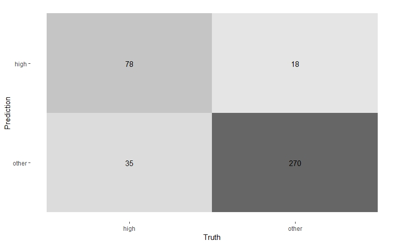
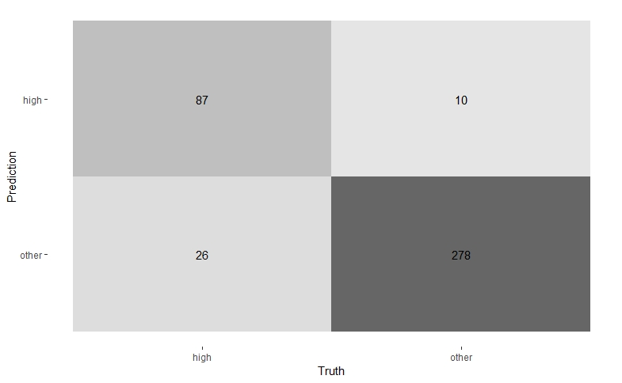
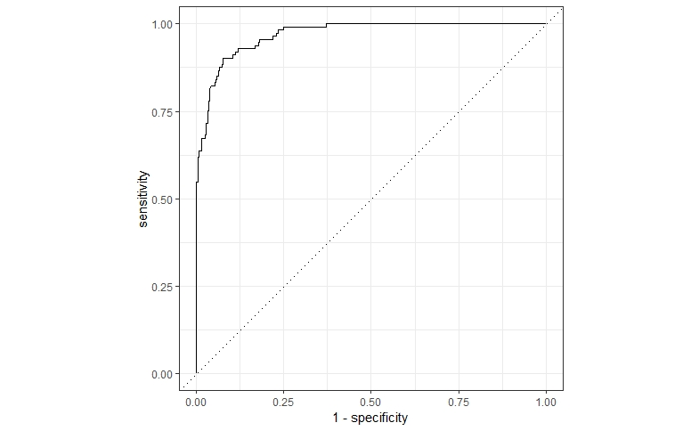
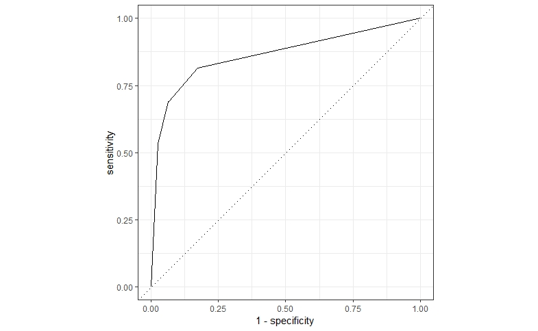

# Neural network report

## Introduction

We are provided with IKEA data to analyse what model prediction on price shows better results.
I took two models- Decision tree and Random forest and lets see what results we got.

## Exploratory data analysis 
First we Splited our modeling to test and training set, with 75% of the data. Our outcome Variable is "Price".
To assess our model performance we used accuracy, precision, recall, roc_auc. 

To perform cross-validation we ran 3 folds and stratify by price

After we find the best model, we apply it to our test set and create confusion model 

In Decision tree our Prediction shows that 78 high price were true positive, 270 other were true negative,18 false positive, and 35 False Negative.

In comparison with Radnom Forest data 
87 high price were true positive, 278 other were true negative,10 false positive, and 26 False Negative.
So we can conclude that Although the difference is minor, but with Random Forest Model we can more true positives and true negatives.

Also if we compare the Roc Curve in Random Forest shows desirable results, since area under the curve is much bigger that show that true positive rate against the positive rate is higher

**Random Forest**

**Decision Tree**

**Decision tree**

*1 accuracy  binary         0.870
*2 precision binary         0.828
*3 recall    binary         0.681
*4 roc_auc   binary         0.858

**Random Forest**

*1 accuracy  binary         0.920
*2 precision binary         0.886
*3 recall    binary         0.823
*4 roc_auc   binary         0.968

## Results
#### From our prediction analysis, it's abvious, that Random Forest model results are better, it's accuracy or error rate is ~92%.It shows better results for precision metric as well, exceeding decition tree result. 

