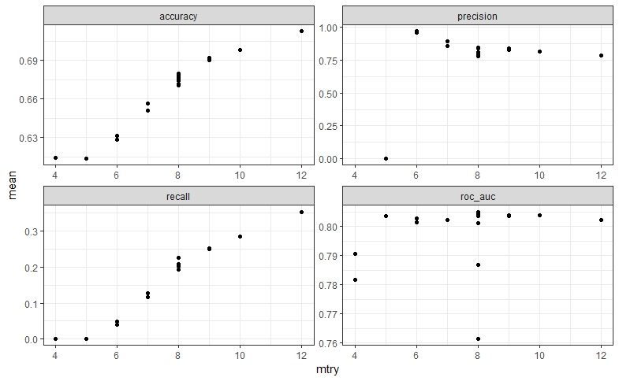
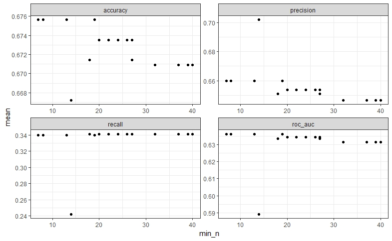
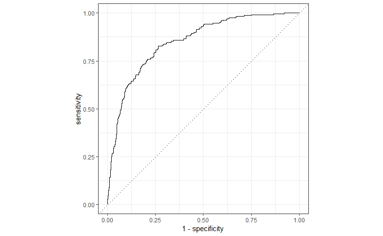
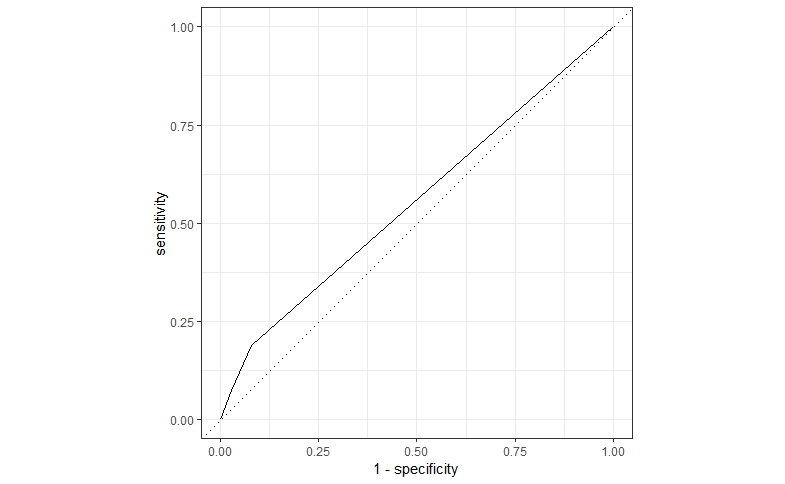

# Neural network report

## Introduction

This document reports the results for Random forest model and Decision tree model for chocolate data.

## Exploratory data analysis

### Plot Comparison for two Models

#### **Random Forest**

#### **Decision Tree**

**Random Forest**

**Decision Tree**

**Random Forest**

* 1 accuracy  binary         0.713
* 2 precision binary         0.832
* 3 recall    binary         0.322
* 4 roc_auc   binary         0.850

**Decision tree**

* 1 accuracy  binary         0.639
* 2 precision binary         0.605
* 3 recall    binary         0.188
* 4 roc_auc   binary         0.555

## Results
#### From our prediction analysis, it's abvious, that Random Forest model results are better, it's accuracy or error rate is ~71%.It shows better results for precision metric as well, exceeding decition tree result by nearly 15%. Roc Curve in Random Forest shows decirable results, since area under the curve is much bigger that show that true positive rate against the positive rate is higher.

