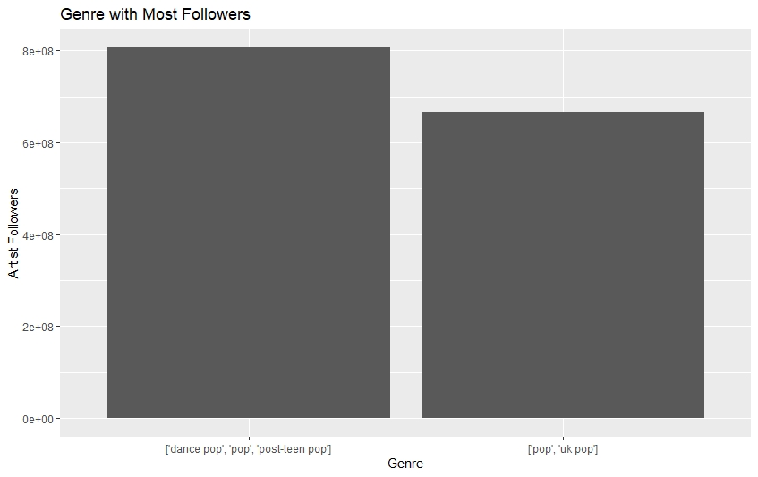

# Spotify Report

Spotify is one of the biggest audio streaming apps worldwide having almost half 
a billion users monthly, having the iTunes(Apple) as its main competitor Spotify
must always have up to date analysis to understand the preferences of their users
and based on that improve the recommendation system within the service.

In this report I will try to explain through Visualization the overal picture and the corelaations
between different variables

## Exporing data through visualizations
Below is shown the most streamed Artists

As a result we can Clearly See that the most Streames artist is Olivia Rodrigo, 
followed by Maneskin and Lil Nas X

Next We will look through the most streamed genres

As we can see over the last 2 years the genres that brought the most streams were
Pop and Italian indie rock (Indie rock Italiano), which matches with the findings from previous 
bar chart, Olivia Rodrigo sings in pop genre and Maneskin is italian indie rock band
while Lil Nas x main genre is [lgbtq+ hip hop', 'pop rap'] which is 3rd most streamed
genre.

let's look through specific songs as well

In this 'Beggin' by Maneskin has .5% of all streams on Spotify. With 48,633,449 
streams total. The average number of streams on this list is 6,369,877. However 
Olivia Rodrigo has 3 songs(deja vu, traitor, good 4 u) in this bar chart counting in total 78,214,99 streams.

As both Olivia Rodriguez and Maneskin are relatevely new artist and this success may be 
just temporary being "one hit" wonders let's look at the most followed artists

In these figure we can see that the most followed artists are Ariana grande Ed Sheeran, While they do not have the most streams the past two years, Arianna Grande and Ed Sheeran still dominate the list in followers.

In The same logic the most followed genres are ['dance pop', 'pop', 'post-teen pop'] and ['pop', 'uk pop'] which are respective genres of Arina Grande and Ed sheeran

Already having the averall picture in terms of artists and genres let's look at specific features of the songs

Ad we look at the chart we can see that there is middle point in Tempo where song is considered "danceable". Too much or too little tempo does not work

However as seen in above figure tempo does not have much effect on the popularity of a song. Although, much like the last visualization, somewhere in the middle of tempo you will find a good portion of the most popular.

The popularity is completely effected though, based on how much speechiness (words spoken) is in the song.

However the data for last two years may be misleading, so let's take a look at the same metrics through the 2010-2019

First let's find out the top streaming artists through the last decade(2010-2019)

We can see that the top artist are changing from year to year, so every year
there is different leaders

next let's look at the genres

So every Year the biggest portions of streamed songs were in the dance pop genre. However from the below graph it can be seen that the number of songs in this genre is constantly decreasing. 

while songs in Latin genre are constantly increasing having almost no proportion in 2017 and 2018

# Conclusion

### Music industry is the most rapidly changing clusters in the world and we saw that in the above charts and graphs there is no constant leader who dominates or even the genre. In recent years it is apparent that music industry becomes more inclusive. It can be seen withe rise of genres like latin, reggaetton and k-pop which were not considered traditionaly popular in terms of popularity in US. Before chances to be globally successful were quite low if you were ot of English speaking world. But now with the rise of streaming services and social media industry is Becoming more inclusive and diverse. That is especially visible when we look at the recent data where in 2020-2021 the 2nd most streamed artist is Italian band Maneskin.

