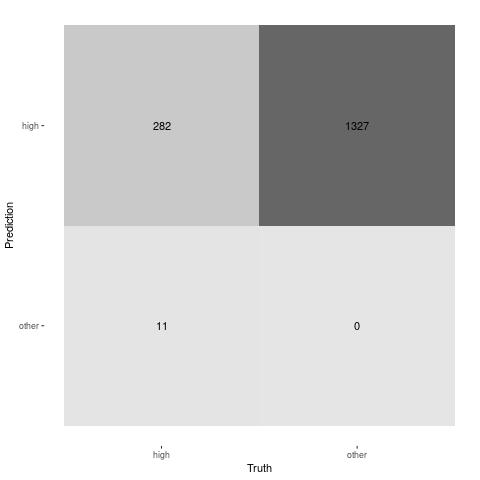

# Neural network report

## Introduction

This document reports the result of a neural network model on the wind turbines data

## Exploratory data analysis

You can include charts in an rmarkdown file as follows:

You can find more on how to use markdown language in [here](https://www.markdownguide.org/cheat-sheet/)

## Results

You can include a plot as follow:

