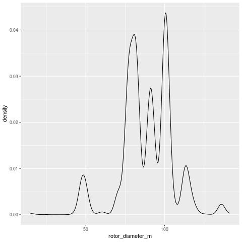

# Neural network report

## Introduction

This document reports the result of a neural network model on the wind turbines data

## Exploratory data analysis

You can include charts saved as images, such as this density plot of rotor diameter:

#### Density plot for rotor diameter

#### Historgram of hub heights

You can find more on how to use markdown language in [here](https://www.markdownguide.org/cheat-sheet/)

For example, you can make text **bold** or *italic*, and you can even create lists:

* First item
* Second item
* Third item

## Results

