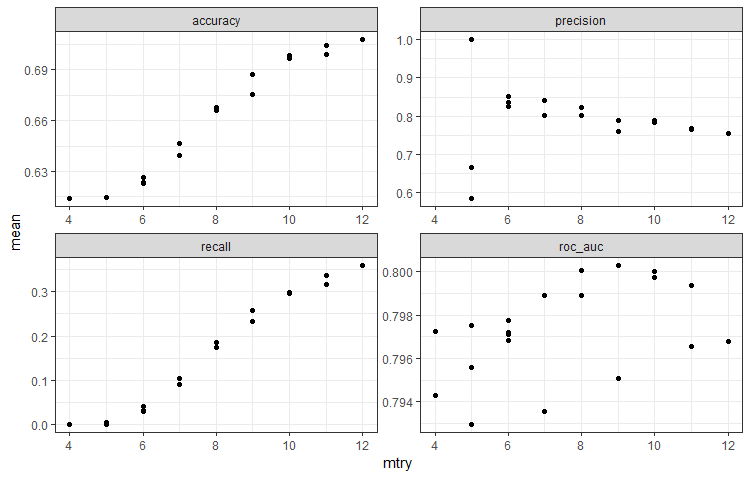
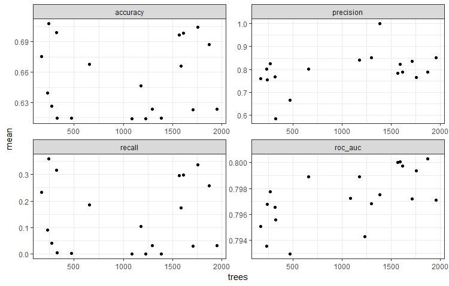
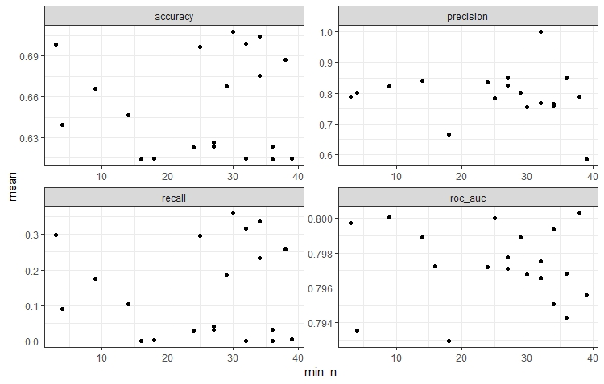
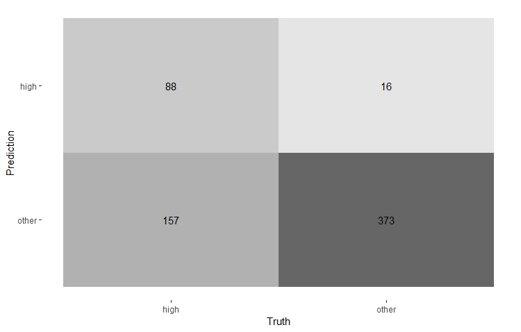
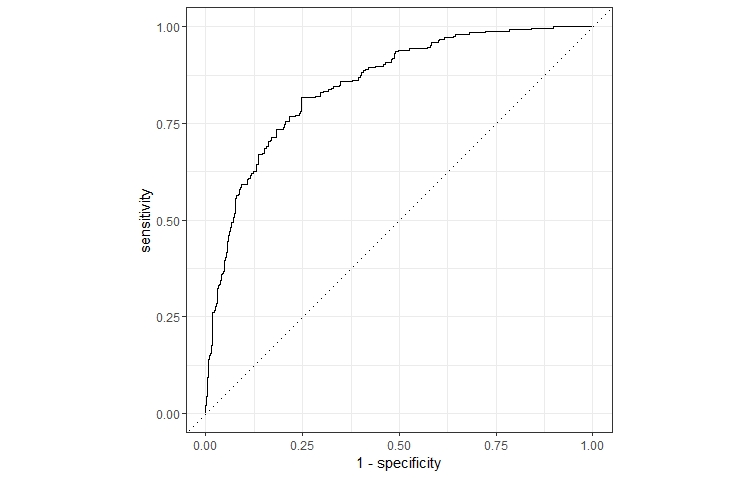
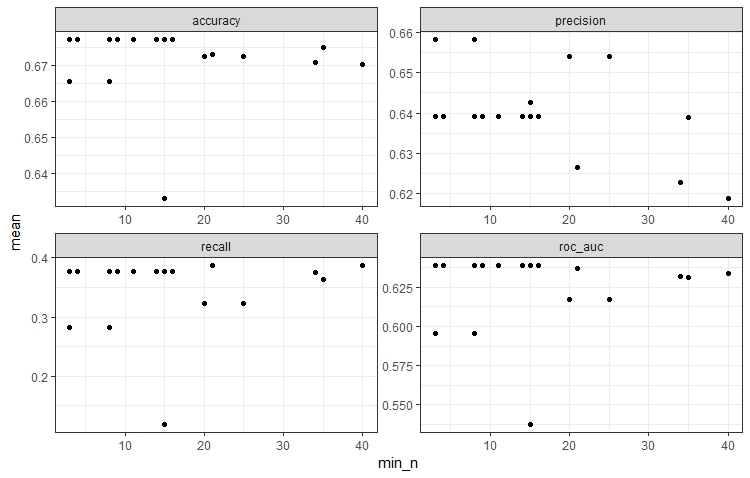
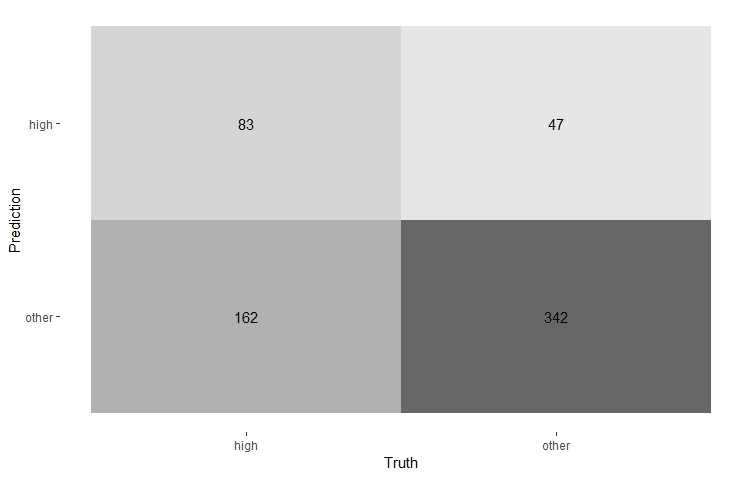
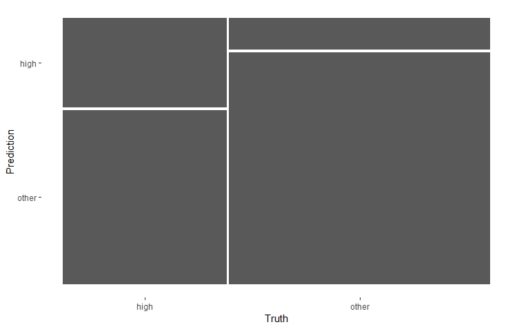
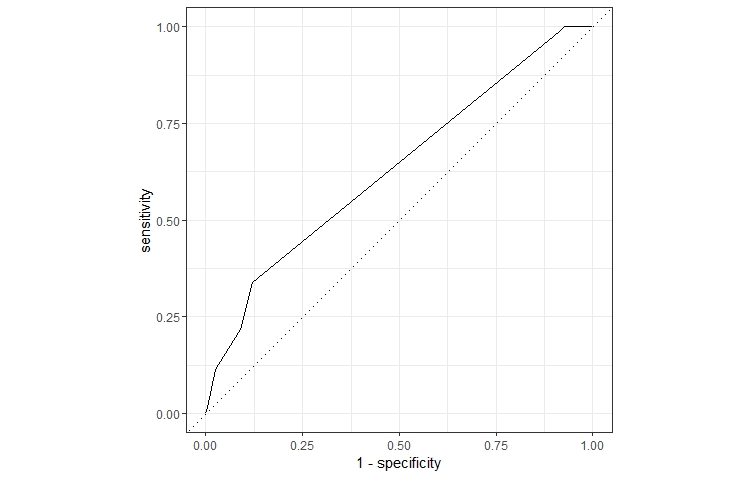

# Chocolate Analysis

## Random Forest Model

### Final results of Random Forest Model

1. **Accuracy**          0.730
2. **Precision**         0.856
3. **Recall**            0.363
4. **ROC AUC**           0.852

### From the final results of Random Forest model we run we can conclude that:

#### 73% of our predictions were correct 
#### 85.6% of the chocolates we predicted had high rating were correctly predicted
#### Our model detected correctly 36.3% of the chocolates which had high rating in reality 

## Decision Tree Model

### Final results of Decision Tree Model

1. **Accuracy**          0.670
2. **Precision**         0.638
3. **Recall**            0.339
4. **ROC AUC**           0.633

### From the final results of Decision Tree we run we can conclude that:

#### 67% of our predictions were correct 
#### 63.8% of the chocolates we predicted had high rating were correctly predicted
#### Our model detected correctly 33.9% of the chocolates which had high rating in reality 

# Conclusion

### From the Results we got by running both models we can defenetely say that for this particular dataset Random Forest Model was better. Exept for Recall results for all three parameters were much higher in the Random Tree model than the results we got through Decision Tree. 
### Especially that is apperent in the ROC parameter. In case of Random Forest AUC is quite big, while the Decision Tree ROC curve is almost flat.

